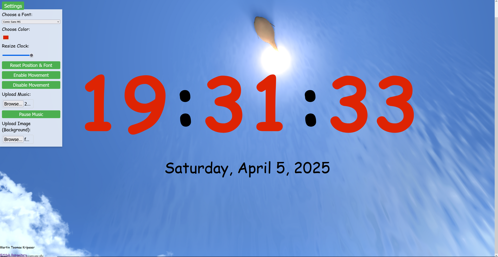

# Projekt: Interaktiivne Kell kodutoo1 Martin Toomas Kripsaar

## Kirjeldus

See veebirakendus kuvab reaalajas kellaaega, kuupäeva, nädalapäeva ja aastat. Kasutaja saab muuta kella atribuute, nagu font, värv, suurus, positsioon ja saab üles laadida taustapildi või muusika. Rakendus on loodud JavaScripti, HTML-i ja CSS-i abil.

## Funktsionaalsus

- Kuvab reaalajas kellaaega, kuupäeva, nädalapäeva ja aastat.
- Kasutaja saab muuta järgmisi kellafunktsioone:
  - Kella fondi muutmine.
  - Kella värvi muutmine.
  - Kella suuruse muutmine.
  - Kella ja kuupäeva liikumisvõimekus (liikumine nooleklahvide ja WASD abil).
  - Taustapildi ja muusika üleslaadimine.
  - Atribuutide lähtestamine (kella, kuupäeva, värvi ja fondi taastamine).
  

## GitHubi repositoorium

Rakenduse lähtekood on saadaval (https://github.com/martkrip/1kodutoo).

## Ekraanipilt

## Kasutatud ChatGPT promptid

1. (Eeldusega, et kõik failid olid copy ja pastitud ChatGPT'sse) I need these features done:
Electronic clock
Written in JavaScript
HTML is used
CSS file is used
The clock fits on the full screen like a desk clock
Use percentage values ​​for CSS
Allow the user to change the clock size
Should show the clock, date, day of the week and year
The user should be able to change the clock, date, day of the week and year attributes
Needs to be a button where it reverts to default in case the user breaks the clock
The js.file uses eventListener and functions
The author's first and last name (Martin Toomas Kripsaar) as well as a link to the application repository (https://github.com/martkrip/1kodutoo) are shown on the page as a small footer
The author's name and the described functionality are shown in the README.md file
Background images can be changed, music can be played in the background Music needs to be able to be turned off or muted
Needs to have a preview option before changing the clock
Clicking on the background changes the background color of the clock
Every the size of the number can be changed separately
The clock can be moved on the screen with the arrow keys (needs to have the option to make the clock static)
Before starting to show the clock, ask the user for their favorite color and do something based on it
Font can be chosen
The user can choose how many times in different parts of the world from the options which will then be shown in a minimalist side panel
You can change the language, clock format, etc.
Alarm feature
Pomodoro timer (25 minutes work, 5 minute break, repeat 4 times then 30 minute break then cycle repeats)
sound effects (duck sounds for the clock, boom sound for the hour, etc) with the ability to turn it off
Ability to upload background images into a so called background library which will be used as background images
The user needs to be able to choose the color of each number in the clock

ChatGPT makes the website

2. Issues:
I need comic sans font available
User can't resize
Clicking anywhere on the background changes the color randomly DOES NOT WORK
The user needs to be able to put a music file to act was the background music
The clock needs to show the day, month and year as well
When i meant by moving the clock i meant the time as in 09:06:30 moving to the left or right or down or up

3. Errors:
Cannot redeclare block-scoped variable "music"

4. Issues:
When selecting background images, it asks for audio files and if you put a photo it doesn't show up in the background
Make the clock movable with arrow keys

5. Issues:
I SPECIFIED THE TIME TO BE MOVEABLE, NOT THE PAGE
I need the user to be able to upload music and background image separately

6. Issues:
Arrow keys still moves the page, not the time
Resetting the clock needs to reset it's size and position to the default one when you start up the page

7. Issues:
Remove the footer
Why is the clock going up to down? You didn't have to change that
Clicking doesn't change the background color, only resetting clock does that (this is unintentional fix this)

8. Issues:
Hour, minute and second need to be next to each other not on top of each other
Every number needs to have it's own size meter like 09:06:00 can have 0 be small and 9 big
Show day, month and year below hour minute and second

9. Why did you remove settings in html?

10. What about the CSS file?

11. /* General Styles */
body {
    margin: 0;
    padding: 0;
    font-family: Arial, sans-serif;
    background-color: aquamarine;
}

#container {
    display: flex;
    justify-content: center;
    align-items: center;
    flex-direction: column;
    height: 100vh;
    transition: transform 0.3s ease, background-color 0.3s ease;
}

/* Time Styling */
#time {
    display: flex;
    justify-content: center;
    align-items: center;
    font-size: 10vw;
    font-weight: bold;
}

.digit {
    margin: 0 2px;
    transition: transform 0.2s ease-in-out;
}

#date {
    margin-top: 20px;
    font-size: 2vw;
}

/* Settings Section */
#settings {
    position: absolute;
    top: 10px;
    right: 10px;
    background-color: rgba(255, 255, 255, 0.8);
    padding: 20px;
    border-radius: 8px;
    box-shadow: 0 4px 8px rgba(0, 0, 0, 0.2);
    font-size: 1.2vw;
    width: 250px;
    display: flex;
    flex-direction: column;
    gap: 10px;
    align-items: flex-start;
}

#settings label {
    font-size: 1.2vw;
}

#settings select,
#settings input {
    width: 100%;
    padding: 5px;
    font-size: 1vw;
    border: 1px solid #ccc;
    border-radius: 5px;
}

#settings input[type="color"] {
    width: 50px;
}

#settings input[type="file"] {
    padding: 10px;
}

button {
    padding: 10px 20px;
    font-size: 1vw;
    cursor: pointer;
    border: none;
    background-color: #4CAF50;
    color: white;
    border-radius: 5px;
    transition: background-color 0.3s ease;
}

button:hover {
    background-color: #45a049;
}

footer {
    position: absolute;
    bottom: 10px;
    left: 10px;
    font-size: 1vw;
}

footer a {
    color: #333;
    text-decoration: none;
}

footer a:hover {
    text-decoration: underline;
}

/* Resizing Styles */
#time {
    transition: font-size 0.3s ease;
}

/* Styles for Clock Movement */
#container {
    transition: transform 0.3s ease-in-out;
}

/* Background Image Styles */
#container {
    background-size: cover;
    background-position: center;
}

ERROR:
Declaration or statement expected

12. oops sorry i copy and pasted the wrong thing:

let h, m, s, dateElement, r, g, b, clockInterval;
let isClockMoving = false;
let isMusicPlaying = false;
let clockPosition = { x: 0 }; // Only horizontal movement now
let font = "Arial";
let defaultPosition = { x: 0 }; // Default position for the clock (no vertical movement)
let defaultSize = "10vw"; // Default clock size

// Declare music once globally
let music = new Audio();

h = document.getElementById("hours");
m = document.getElementById("minutes");
s = document.getElementById("seconds");
dateElement = document.getElementById("date");

const resetBtn = document.getElementById("reset");
const toggleMusicBtn = document.getElementById("toggleMusic");
const fontSelector = document.getElementById("font-selector");
const colorPicker = document.getElementById("colorPicker");
const moveClockBtn = document.getElementById("moveClock");
const staticClockBtn = document.getElementById("staticClock");
const container = document.getElementById("container");
const uploadMusic = document.getElementById("uploadMusic");
const uploadImage = document.getElementById("uploadImage");
const resizeClock = document.getElementById("resizeClock");

// Change color of clock when clicking on container
function changeColor() {
    r = Math.ceil(Math.random() * 255);
    g = Math.ceil(Math.random() * 255);
    b = Math.ceil(Math.random() * 255);
    container.style.backgroundColor = `rgb(${r},${g},${b})`;
}

// Update clock
function updateClock() {
    let date = new Date();
    let hourVal = date.getHours();
    let minuteVal = date.getMinutes();
    let secondVal = date.getSeconds();
    let day = date.getDate();
    let weekday = date.getDay();
    let month = date.getMonth();
    let year = date.getFullYear();

    if (hourVal < 10) hourVal = "0" + hourVal;
    if (minuteVal < 10) minuteVal = "0" + minuteVal;
    if (secondVal < 10) secondVal = "0" + secondVal;

    // Update individual digits for hour, minute, and second
    h.innerHTML = formatDigits(hourVal);
    m.innerHTML = formatDigits(minuteVal);
    s.innerHTML = formatDigits(secondVal);

    dateElement.innerHTML = `${weekNames[weekday]}, ${monthNames[month]} ${day}, ${year}`;
}

// Format digits to have varying sizes
function formatDigits(time) {
    let timeString = time.toString();
    return timeString.split("").map(digit => `${digit}`).join("");
}

// Music toggle
toggleMusicBtn.addEventListener("click", () => {
    isMusicPlaying = !isMusicPlaying;
    if (isMusicPlaying) {
        music.play();
    } else {
        music.pause();
    }
});

// Music upload
uploadMusic.addEventListener("change", (e) => {
    const file = e.target.files[0];
    if (file && file.type.startsWith("audio")) {
        music.src = URL.createObjectURL(file);
        music.loop = true;
        music.play();
    }
});

// Background image upload
uploadImage.addEventListener("change", (e) => {
    const file = e.target.files[0];
    if (file && file.type.startsWith("image")) {
        const reader = new FileReader();
        reader.onload = function(event) {
            container.style.backgroundImage = `url(${event.target.result})`;
            container.style.backgroundSize = "cover";
            container.style.backgroundPosition = "center";
        };
        reader.readAsDataURL(file);
});

// Reset clock (Position and size reset)
resetBtn.addEventListener("click", () => {
    container.style.backgroundColor = "aquamarine"; // Reset to default background color
    changeColor(); // This is to reset the background color at the start
    fontSelector.value = "Arial";
    document.body.style.fontFamily = "Arial";
    
    // Reset position and size to defaults
    clockPosition = { ...defaultPosition };
    container.style.transform = `translateX(${clockPosition.x}px)`; // Only horizontal reset
    document.getElementById("time").style.fontSize = defaultSize;
});

// Font change
fontSelector.addEventListener("change", (e) => {
    font = e.target.value;
    document.body.style.fontFamily = font;
});

// Color picker
colorPicker.addEventListener("input", (e) => {
    const color = e.target.value;
    h.style.color = color;
    m.style.color = color;
    s.style.color = color;
});

// Clock resize
resizeClock.addEventListener("input", (e) => {
    let newSize = e.target.value;
    document.getElementById("time").style.fontSize = `${newSize}vw`;
});

// Moving the clock with arrow keys (only horizontal movement now)
document.addEventListener("keydown", (e) => {
    if (isClockMoving) {
        switch (e.key) {
            case "ArrowLeft":
                clockPosition.x -= 10;
                break;
            case "ArrowRight":
                clockPosition.x += 10;
                break;
            default:
                return;
        }
        container.style.transform = `translateX(${clockPosition.x}px)`; // Only move horizontally
    }
});

// Make clock move
moveClockBtn.addEventListener("click", () => {
    isClockMoving = true;
});

// Make clock static (stop moving)
staticClockBtn.addEventListener("click", () => {
    isClockMoving = false;
});

// Add event listener for clicking to change the background color (only on container)
container.addEventListener("click", changeColor);

setInterval(updateClock, 1000);
updateClock();

ERROR:
Declaration or statement expected

13. Why is the clock 000?

14. Why is the clock not working?

15. Go back

16. I meant revert to the previous version

17. Revert back to the previous version

18. I meant the previous previous

19. (Content removed)

20. You are giving me the same version

21. (CSS Changes (Optional)) Go back to here with css

22. (HTML (for image upload) Go back to here with html file

23. Ok where are the options to change stuff?

24. Issues:
Make the settings on the top
The clock isn't working

25. Ok cool you fixed the clock, but the settings tab is way too large can you make it smaller?

26. Way smaller and also the bars don't have to be long

27. Ok you're almost there:
Can you make it so that the settings tab can be turned off and on?

28. Issues:
You made : disappear between hour, minute and second
Day, month and year isnt working now
Toggle settings is obfuscating the font, so maybe make the toggle settings button smaller and the settings tab a bit lower on the screen

29. You fixed the day, month and year, but the colon isn't appearing still

30. Day, Month Date, Year isn't working

31. Why is it that when you change something, something else breaks+

32. Ok well you already fixed everything in the last post

33. Font isn't changingf

34. Great! You fixed the font settings

35. The color system isn't working

36. HTML file:
// Color picker logic
colorPicker.addEventListener("input", (e) => {
    const color = e.target.value;
    h.style.color = color;  // Update the color of the hour
    m.style.color = color;  // Update the color of the minute
    s.style.color = color;  // Update the color of the second
});

JS file:
let h, m, s, dateElement, r, g, b, clockInterval;
let isClockMoving = false;
let isMusicPlaying = false;
let clockPosition = { x: 0 };
let font = "Arial";
let defaultPosition = { x: 0 };
let defaultSize = "10vw";

// Declare music once globally
let music = new Audio();

// Arrays for week days and months
const weekNames = ["Sunday", "Monday", "Tuesday", "Wednesday", "Thursday", "Friday", "Saturday"];
const monthNames = ["January", "February", "March", "April", "May", "June", "July", "August", "September", "October", "November", "December"];

h = document.getElementById("hours");
m = document.getElementById("minutes");
s = document.getElementById("seconds");
dateElement = document.getElementById("date");

const resetBtn = document.getElementById("reset");
const toggleMusicBtn = document.getElementById("toggleMusic");
const fontSelector = document.getElementById("font-selector");
const colorPicker = document.getElementById("colorPicker");
const moveClockBtn = document.getElementById("moveClock");
const staticClockBtn = document.getElementById("staticClock");
const container = document.getElementById("container");
const uploadMusic = document.getElementById("uploadMusic");
const uploadImage = document.getElementById("uploadImage");
const resizeClock = document.getElementById("resizeClock");
const toggleSettingsBtn = document.getElementById("toggleSettingsBtn");
const settings = document.getElementById("settings");

// Change color of clock when clicking on container
function changeColor() {
    r = Math.ceil(Math.random() * 255);
    g = Math.ceil(Math.random() * 255);
    b = Math.ceil(Math.random() * 255);
    container.style.backgroundColor = rgb(${r},${g},${b});
}
// Font change logic
fontSelector.addEventListener("change", (e) => {
    font = e.target.value;
    document.body.style.fontFamily = font;  // Change the global font
    document.getElementById("time").style.fontFamily = font;  // Change the clock's font
});

// Update clock
function updateClock() {
    let date = new Date();
    let hourVal = date.getHours();
    let minuteVal = date.getMinutes();
    let secondVal = date.getSeconds();
    let day = date.getDate();
    let weekday = date.getDay();
    let month = date.getMonth();
    let year = date.getFullYear();

    // Format the hours, minutes, and seconds to always have two digits
    if (hourVal < 10) hourVal = "0" + hourVal;
    if (minuteVal < 10) minuteVal = "0" + minuteVal;
    if (secondVal < 10) secondVal = "0" + secondVal;

    // Update individual digits for hour, minute, and second
    h.innerHTML = formatDigits(hourVal);
    m.innerHTML = formatDigits(minuteVal);
    s.innerHTML = formatDigits(secondVal);

    // Update the date (day, month, year) in the format "Weekday, Month Day, Year"
    dateElement.innerHTML = ${weekNames[weekday]}, ${monthNames[month]} ${day}, ${year};
}

// Format digits to have varying sizes
function formatDigits(time) {
    let timeString = time.toString();
    return timeString.split("").map(digit => ${digit}).join("");
}

// Function to update the clock with the colon between the digits
function displayTime() {
    let date = new Date();
    let hour = date.getHours();
    let minute = date.getMinutes();
    let second = date.getSeconds();

    if (hour < 10) hour = "0" + hour;
    if (minute < 10) minute = "0" + minute;
    if (second < 10) second = "0" + second;

    // Now we'll display the time with a colon between hours, minutes, and seconds
    h.innerHTML = formatDigits(hour);
    m.innerHTML = formatDigits(minute);
    s.innerHTML = formatDigits(second);

    // Add colon in between
    document.getElementById("time").innerHTML = ${h.innerHTML}:${m.innerHTML}:${s.innerHTML};
}
// Color picker logic
colorPicker.addEventListener("input", (e) => {
    const color = e.target.value;
    h.style.color = color;  // Update the color of the hour
    m.style.color = color;  // Update the color of the minute
    s.style.color = color;  // Update the color of the second
});

// Toggle the settings panel visibility
toggleSettingsBtn.addEventListener("click", () => {
    if (settings.style.display === "none" || settings.style.display === "") {
        settings.style.display = "flex"; // Show settings
    } else {
        settings.style.display = "none"; // Hide settings
    }
});

setInterval(displayTime, 1000);
updateClock();

css file:
/* General Styles */
body {
    margin: 0;
    padding: 0;
    font-family: Arial, sans-serif;
    background-color: aquamarine;
}

/* Settings Section - Initially hidden */
#settings {
    position: fixed;
    top: 50px; /* Lower the settings panel */
    left: 0;
    right: 0;
    background-color: rgba(255, 255, 255, 0.8);
    padding: 10px;
    box-shadow: 0 4px 8px rgba(0, 0, 0, 0.2);
    z-index: 10;
    font-size: 0.9vw;
    display: none; /* Initially hidden */
    flex-direction: column;
    gap: 6px;
    max-width: 300px;
    width: auto;
}

/* Adjust the layout of settings */
#settings label,
#settings select,
#settings input,
#settings button {
    margin-bottom: 5px;
    width: 100%;
}

/* Other input styles */
#settings input {
    padding: 5px;
    font-size: 0.9vw;
    width: 150px;
    border: 1px solid #ccc;
    border-radius: 5px;
}

#settings input[type="color"] {
    width: 40px;
}

/* Button Styling */
button {
    padding: 6px 12px;
    font-size: 0.9vw;
    cursor: pointer;
    border: none;
    background-color: #4CAF50;
    color: white;
    border-radius: 5px;
    transition: background-color 0.3s ease;
}

button:hover {
    background-color: #45a049;
}

/* Settings Toggle Button Styling */
#toggleSettingsBtn {
    position: fixed;
    top: 10px;
    left: 10px;
    padding: 6px 12px; /* Smaller padding */
    background-color: #4CAF50;
    color: white;
    border: none;
    border-radius: 5px;
    cursor: pointer;
    z-index: 11; /* Make sure it is above other elements */
    font-size: 1vw; /* Smaller font size */
}

#toggleSettingsBtn:hover {
    background-color: #45a049;
}

/* Clock Styling */
#container {
    display: flex;
    justify-content: center;
    align-items: center;
    flex-direction: column;
    height: 100vh;
    transition: background-color 0.3s ease;
}

#time {
    display: flex;
    justify-content: center;
    align-items: center;
    font-size: 10vw;
    font-weight: bold;
}

.digit {
    margin: 0 2px;
    transition: transform 0.2s ease-in-out;
}

#date {
    margin-top: 20px;
    font-size: 2vw;
}

/* Resizing Styles */
#time {
    font-size: 10vw;
    font-weight: bold;
    font-family: Arial, sans-serif; /* Default font */
}
#hours, #minutes, #seconds {
    color: #000000;  /* Initial color of clock digits */
}

Why isn't the color system working?

37. Could it be that there are features that are conflicting with each other?

38. Can i get rid of hour, minute and second in updateClock()

39. wait what? You didn't do anything

40. I meant HourVal, minuteVal, secondVal

41. let h, m, s, dateElement, r, g, b, clockInterval;
let isClockMoving = false;
let isMusicPlaying = false;
let clockPosition = { x: 0 };
let font = "Arial";
let defaultPosition = { x: 0 };
let defaultSize = "10vw";

// Declare music once globally
let music = new Audio();

// Arrays for week days and months
const weekNames = ["Sunday", "Monday", "Tuesday", "Wednesday", "Thursday", "Friday", "Saturday"];
const monthNames = ["January", "February", "March", "April", "May", "June", "July", "August", "September", "October", "November", "December"];

h = document.getElementById("hours");
m = document.getElementById("minutes");
s = document.getElementById("seconds");
dateElement = document.getElementById("date");

const resetBtn = document.getElementById("reset");
const toggleMusicBtn = document.getElementById("toggleMusic");
const fontSelector = document.getElementById("font-selector");
const colorPicker = document.getElementById("colorPicker");
const moveClockBtn = document.getElementById("moveClock");
const staticClockBtn = document.getElementById("staticClock");
const container = document.getElementById("container");
const uploadMusic = document.getElementById("uploadMusic");
const uploadImage = document.getElementById("uploadImage");
const resizeClock = document.getElementById("resizeClock");
const toggleSettingsBtn = document.getElementById("toggleSettingsBtn");
const settings = document.getElementById("settings");

// Change color of clock when clicking on container
function changeColor() {
    r = Math.ceil(Math.random() * 255);
    g = Math.ceil(Math.random() * 255);
    b = Math.ceil(Math.random() * 255);
    container.style.backgroundColor = `rgb(${r},${g},${b})`;
}
// Font change logic
fontSelector.addEventListener("change", (e) => {
    font = e.target.value;
    document.body.style.fontFamily = font;  // Change the global font
    document.getElementById("time").style.fontFamily = font;  // Change the clock's font
});

// Update clock
function updateDate() {
    let date = new Date();
    let day = date.getDate();
    let weekday = date.getDay();
    let month = date.getMonth();
    let year = date.getFullYear();

    // Format the hours, minutes, and seconds to always have two digits

    // Update the date (day, month, year) in the format "Weekday, Month Day, Year"
    dateElement.innerHTML = `${weekNames[weekday]}, ${monthNames[month]} ${day}, ${year}`;
}

// Format digits to have varying sizes
function formatDigits(time) {
    let timeString = time.toString();
    return timeString.split("").map(digit => `${digit}`).join("");
}

// Function to update the clock with the colon between the digits
function displayTime() {
    let date = new Date();
    let hour = date.getHours();
    let minute = date.getMinutes();
    let second = date.getSeconds();

    if (hour < 10) hour = "0" + hour;
    if (minute < 10) minute = "0" + minute;
    if (second < 10) second = "0" + second;

    // Now we'll display the time with a colon between hours, minutes, and seconds
    h.innerHTML = formatDigits(hour);
    m.innerHTML = formatDigits(minute);
    s.innerHTML = formatDigits(second);

    // Add colon in between
    document.getElementById("time").innerHTML = `${h.innerHTML}:${m.innerHTML}:${s.innerHTML}`;
}
// Color picker logic
console.log(colorPicker);
colorPicker.addEventListener("input", (e) => {
    const color = e.target.value;
    console.log(color);
    h.style.color = color;  // Update the color of the hour
    m.style.color = color;  // Update the color of the minute
    s.style.color = color;  // Update the color of the second
});

// Toggle the settings panel visibility
toggleSettingsBtn.addEventListener("click", () => {
    if (settings.style.display === "none" || settings.style.display === "") {
        settings.style.display = "flex"; // Show settings
    } else {
        settings.style.display = "none"; // Hide settings
    }
});

setInterval(displayTime, 1000);
updateDate();

Here is the updated js file

42. ChatGPT please stop changing the code immediately after i post something

43. js file:

let h, m, s, dateElement, r, g, b, clockInterval;
let isClockMoving = false;
let isMusicPlaying = false;
let clockPosition = { x: 0 };
let font = "Arial";
let defaultPosition = { x: 0 };
let defaultSize = "10vw";

// Declare music once globally
let music = new Audio();

// Arrays for week days and months
const weekNames = ["Sunday", "Monday", "Tuesday", "Wednesday", "Thursday", "Friday", "Saturday"];
const monthNames = ["January", "February", "March", "April", "May", "June", "July", "August", "September", "October", "November", "December"];

h = document.getElementById("hours");
m = document.getElementById("minutes");
s = document.getElementById("seconds");
dateElement = document.getElementById("date");

const resetBtn = document.getElementById("reset");
const toggleMusicBtn = document.getElementById("toggleMusic");
const fontSelector = document.getElementById("font-selector");
const colorPicker = document.getElementById("colorPicker");
const moveClockBtn = document.getElementById("moveClock");
const staticClockBtn = document.getElementById("staticClock");
const container = document.getElementById("container");
const uploadMusic = document.getElementById("uploadMusic");
const uploadImage = document.getElementById("uploadImage");
const resizeClock = document.getElementById("resizeClock");
const toggleSettingsBtn = document.getElementById("toggleSettingsBtn");
const settings = document.getElementById("settings");

// Change color of clock when clicking on container
function changeColor() {
    r = Math.ceil(Math.random() * 255);
    g = Math.ceil(Math.random() * 255);
    b = Math.ceil(Math.random() * 255);
    container.style.backgroundColor = `rgb(${r},${g},${b})`;
}
// Font change logic
fontSelector.addEventListener("change", (e) => {
    font = e.target.value;
    document.body.style.fontFamily = font;  // Change the global font
    document.getElementById("time").style.fontFamily = font;  // Change the clock's font
});

// Update clock
function updateDate() {
    let date = new Date();
    let day = date.getDate();
    let weekday = date.getDay();
    let month = date.getMonth();
    let year = date.getFullYear();

    // Format the hours, minutes, and seconds to always have two digits

    // Update the date (day, month, year) in the format "Weekday, Month Day, Year"
    dateElement.innerHTML = `${weekNames[weekday]}, ${monthNames[month]} ${day}, ${year}`;
}

// Format digits to have varying sizes
function formatDigits(time) {
    let timeString = time.toString();
    return timeString.split("").map(digit => `${digit}`).join("");
}

// Function to update the clock with the colon between the digits
function displayTime() {
    let date = new Date();
    let hour = date.getHours();
    let minute = date.getMinutes();
    let second = date.getSeconds();

    if (hour < 10) hour = "0" + hour;
    if (minute < 10) minute = "0" + minute;
    if (second < 10) second = "0" + second;

    // Now we'll display the time with a colon between hours, minutes, and seconds
    h.innerHTML = formatDigits(hour);
    m.innerHTML = formatDigits(minute);
    s.innerHTML = formatDigits(second);

    // Add colon in between
    document.getElementById("time").innerHTML = `${h.innerHTML}:${m.innerHTML}:${s.innerHTML}`;
}
// Color picker logic
console.log(colorPicker);
colorPicker.addEventListener("input", (e) => {
    const color = e.target.value;
    console.log(color);
    h.style.color = color;  // Update the color of the hour
    m.style.color = color;  // Update the color of the minute
    s.style.color = color;  // Update the color of the second
});

// Toggle the settings panel visibility
toggleSettingsBtn.addEventListener("click", () => {
    if (settings.style.display === "none" || settings.style.display === "") {
        settings.style.display = "flex"; // Show settings
    } else {
        settings.style.display = "none"; // Hide settings
    }
});
HTML file:
setInterval(displayTime, 1000);
updateDate();
<!DOCTYPE html>
<html lang="en">
<head>
    <meta charset="UTF-8">
    <meta name="viewport" content="width=device-width, initial-scale=1.0">
    <link rel="stylesheet" href="clock.css">
    
    <title>Clock</title>
</head>
<body>
    

        

            
00

            
00

            
00

        

        
Day, Month Date, Year

    

    <!-- Settings Toggle Button -->
    <button id="toggleSettingsBtn">Settings</button>

    <!-- Settings Section -->
    

        <label for="font-selector">Choose a Font:</label>
        <select id="font-selector">
            <option value="Arial">Arial</option>
            <option value="Comic Sans MS">Comic Sans MS</option>
            <option value="Courier New">Courier New</option>
            <option value="Georgia">Georgia</option>
            <option value="Times New Roman">Times New Roman</option>
            <!-- Add more font options as needed -->
        </select>
    

        <label for="colorPicker">Choose Color:</label>
        <input type="color" id="colorPicker" />

        <label for="resizeClock">Resize Clock:</label>
        <input type="range" id="resizeClock" min="5" max="15" value="10" step="1" />

        <button id="reset">Reset</button>
        <button id="moveClock">Enable Movement</button>
        <button id="staticClock">Disable Movement</button>

        <label for="uploadMusic">Upload Music:</label>
        <input type="file" id="uploadMusic" accept="audio/*" />

        <label for="uploadImage">Upload Background Image:</label>
        <input type="file" id="uploadImage" accept="image/*" />
    

    <footer>
        
Martin Toomas Kripsaar

        <a href="https://github.com/martkrip/1kodutoo">GitHub Repository</a>
    </footer>
</body>
</html>

CSS file:
/* General Styles */
body {
    margin: 0;
    padding: 0;
    font-family: Arial, sans-serif;
    background-color: aquamarine;
}

/* Settings Section - Initially hidden */
#settings {
    position: fixed;
    top: 50px; /* Lower the settings panel */
    left: 0;
    right: 0;
    background-color: rgba(255, 255, 255, 0.8);
    padding: 10px;
    box-shadow: 0 4px 8px rgba(0, 0, 0, 0.2);
    z-index: 10;
    font-size: 0.9vw;
    display: none; /* Initially hidden */
    flex-direction: column;
    gap: 6px;
    max-width: 300px;
    width: auto;
}

/* Adjust the layout of settings */
#settings label,
#settings select,
#settings input,
#settings button {
    margin-bottom: 5px;
    width: 100%;
}

/* Other input styles */
#settings input {
    padding: 5px;
    font-size: 0.9vw;
    width: 150px;
    border: 1px solid #ccc;
    border-radius: 5px;
}

#settings input[type="color"] {
    width: 40px;
}

/* Button Styling */
button {
    padding: 6px 12px;
    font-size: 0.9vw;
    cursor: pointer;
    border: none;
    background-color: #4CAF50;
    color: white;
    border-radius: 5px;
    transition: background-color 0.3s ease;
}

button:hover {
    background-color: #45a049;
}

/* Settings Toggle Button Styling */
#toggleSettingsBtn {
    position: fixed;
    top: 10px;
    left: 10px;
    padding: 6px 12px; /* Smaller padding */
    background-color: #4CAF50;
    color: white;
    border: none;
    border-radius: 5px;
    cursor: pointer;
    z-index: 11; /* Make sure it is above other elements */
    font-size: 1vw; /* Smaller font size */
}

#toggleSettingsBtn:hover {
    background-color: #45a049;
}

/* Clock Styling */
#container {
    display: flex;
    justify-content: center;
    align-items: center;
    flex-direction: column;
    height: 100vh;
    transition: background-color 0.3s ease;
}

#time {
    display: flex;
    justify-content: center;
    align-items: center;
    font-size: 10vw;
    font-weight: bold;
}

.digit {
    margin: 0 2px;
    transition: transform 0.2s ease-in-out;
}

#date {
    margin-top: 20px;
    font-size: 2vw;
}

/* Resizing Styles */
#time {
    font-size: 10vw;
    font-weight: bold;
    font-family: Arial, sans-serif; /* Default font */
}
#hours, #minutes, #seconds {
    color: #000000;  /* Initial color of clock digits */
}
The digit colors aren't changing when i change the color in the settings

44. The color changes back to the default black after a second

45. Great job! Make sure this is the fallback version for now

46. The fallback version includes all the HTML, CSS and JS file

47. As you can see in the files, it should be possible to resize the clock (hours, minutes, second and the date) but it is broken, can you fix it?

48. Thank you. It works now. Set all the files for this to be the next fallback version

49. As you can see in the files, it should be possible to reset the time and date to it's default position as well as colour

50. Clock size is resetting but not the color nor the font

51. Same issue remains

52. Wait actually you fixed it in the previous version, i missed one of your changes but now i put in the code so everything's fine now

53. I would like for the time and date to be moveable with arrow keys and WASD, can you do that?

54. Both the clock and date should be moving at the same time

55. Great job! Can you make it so that the reset button resets the time and date position back to it's default position?

56. const defaultPosition = { x: 0, y: 0 }; Does this replace let clockPosition = { x: 0, y: 0 }; // Store the position of the clock and date

57. Hold on i made a mistake

58. Does const defaultPosition = { x: 0, y: 0 }; replace let defaultPosition = { x: 0 };

59. The reset button seems to be not resetting the colour

60. It seems that the reset button doesn't reset the date and time position until i press an arrow key and the colour still isn't resetting

61. Well you fixed the problem with the positions but the colour and font aren't reverting to default

62. Font and position changes to default but not the color

63. Same issue remains, I guess the best option would just be to maintain this bug

64. /* General Styles */
body {
    margin: 0;
    padding: 0;
    font-family: Arial, sans-serif;
    background-color: aquamarine;
}

/* Settings Section - Initially hidden */
#settings {
    position: fixed;
    top: 50px; /* Lower the settings panel */
    left: 0;
    right: 0;
    background-color: rgba(255, 255, 255, 0.8);
    padding: 10px;
    box-shadow: 0 4px 8px rgba(0, 0, 0, 0.2);
    z-index: 10;
    font-size: 0.9vw;
    display: none; /* Initially hidden */
    flex-direction: column;
    gap: 6px;
    max-width: 300px;
    width: auto;
}

/* Adjust the layout of settings */
#settings label,
#settings select,
#settings input,
#settings button {
    margin-bottom: 5px;
    width: 100%;
}

/* Other input styles */
#settings input {
    padding: 5px;
    font-size: 0.9vw;
    width: 150px;
    border: 1px solid #ccc;
    border-radius: 5px;
}

#settings input[type="color"] {
    width: 40px;
}

/* Button Styling */
button {
    padding: 6px 12px;
    font-size: 0.9vw;
    cursor: pointer;
    border: none;
    background-color: #4CAF50;
    color: white;
    border-radius: 5px;
    transition: background-color 0.3s ease;
}

button:hover {
    background-color: #45a049;
}

/* Settings Toggle Button Styling */
#toggleSettingsBtn {
    position: fixed;
    top: 10px;
    left: 10px;
    padding: 6px 12px; /* Smaller padding */
    background-color: #4CAF50;
    color: white;
    border: none;
    border-radius: 5px;
    cursor: pointer;
    z-index: 11; /* Make sure it is above other elements */
    font-size: 1vw; /* Smaller font size */
}

#toggleSettingsBtn:hover {
    background-color: #45a049;
}

/* Clock Styling */
#container {
    display: flex;
    justify-content: center;
    align-items: center;
    flex-direction: column;
    height: 100vh;
    transition: background-color 0.3s ease;
}

#time {
    display: flex;
    justify-content: center;
    align-items: center;
    font-size: 10vw;
    font-weight: bold;
    font-size: 10vw;
    font-weight: bold;
    font-family: Arial, sans-serif; /* Default font */
}

.digit {
    margin: 0 2px;
    transition: transform 0.2s ease-in-out;
}

#date {
    margin-top: 20px;
    font-size: 2vw;
    color: #000000;
}

/* Resizing Styles */

#hours, #minutes, #seconds {
    color: #000000 !important;  /* Default color for clock digits */
}

#time, #date {
    position: relative; /* Allows both elements to be moved */
}

Well the css file seems fine

65. Change the reset text to reset position & font

66. As you can see in the js file. There was supposed to be an option to upload music so that you could hear it, however this feature does not work, please fix it

67. Great job! Make this the new fallback version

68. Great job! Make all the files now the fallback version

69. Problem:
I would like the ability to set an background image. please fix it

70. How does the website fit the requirements?

    Veebirakendus töötab. Näitab kella, kuupäeva, nädalapäeva ja aastat.
    Vastavalt kasutaja tegevusele on võimalik muuta kuut lauakella atribuuti muuta.
    Kasutatud on eventListener'e ja funktsioone.
    Kell on originaalne ning kasutajaliides on maitsekalt kujundatud kasutades CSS-i.
    Autori ees- ja perenimi on lehel välja toodud
    Lehel on viide rakenduse repositooriumile
    README.md failis on välja toodud autori nimi, ekraanipilt rakendusest ja kirjeldatud funktsionaalsus
    Viidata kogu koodis promptidele, millega kood saadi.

71. Viidata kogu koodis promptidele, millega kood saadi. Does this work too if i put it in the readme.md?

72. How do i cite ChatGPT though?

73. Do i have to put every prompt there?

74. Do the md fail but in estonian

75. Make a list of every prompt i made in this session // (Sai lõpuks ainult 36 prompte)

76. wait what happened to the prompts before i asked you to  stop changing the code immediately

77. and before that too

78. and before that too
